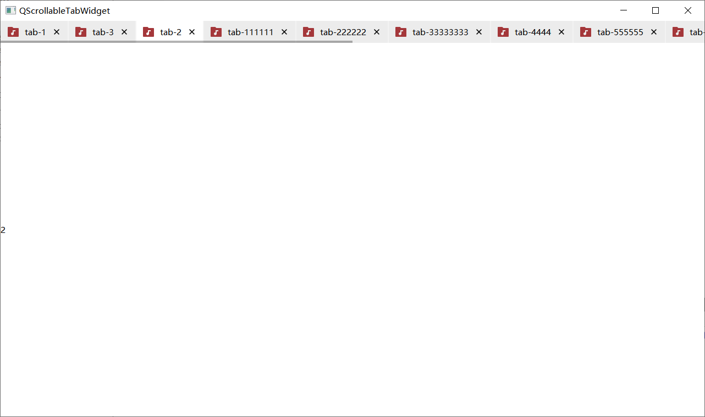

# QScrollableTabWidget

Tab widget with scroll bar instead of scroll button, similar with VSCode.

There's opacity animation with the scroll bar.

You may change the style with Qt stylesheets.

## More

Required: Qt Widgets Modules

License: Apache 2.0

Have fun.